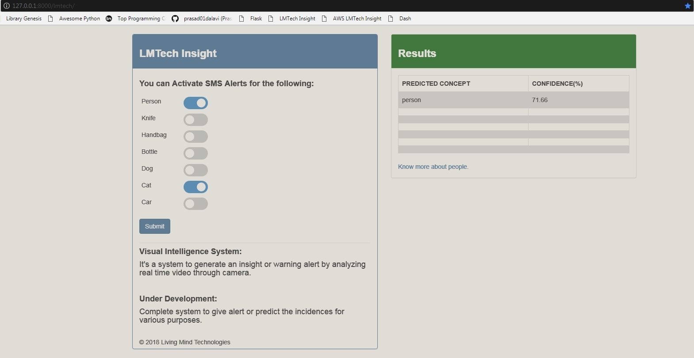
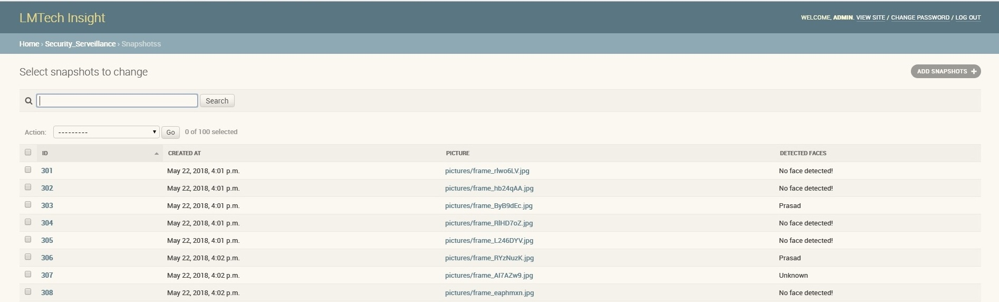
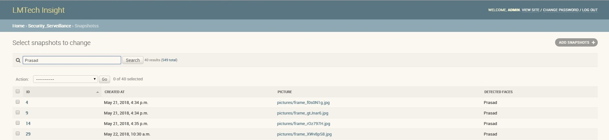

# Security and Serveillance System
Security and Serveillance system using Tensorflow Object Detection API and Opencv

 <p align="center">
  
 </p> 
 
 When we click on "know more about people" link it will give a big list of detected faces of people:
 <p align="center">
  
 </p> 
 
 You can search for required person:
 <p align="center">
  
 </p> 
 <hr>
 <br>

## Installations and Setup:
```bash
# Download Tensorflow 1.4.0 on RPi for Python3
wget http://ci.tensorflow.org/view/Nightly/job/nightly-pi-python3/39/artifact/output-artifacts/tensorflow-1.4.0-cp34-none-any.whl
sudo pip3 install ./tensorflow-1.4.0-cp34-none-any.whl

# Verify the Installation:
python3
>> import tensorflow as tf
>> tf.VERSION

# Install matplotlib on RPi for Python3
sudo pip3 install matplotlib
sudo apt-get install python3-cairo
```
Install Opencv3 on RPi for Python3

Youtube Video: 
https://www.youtube.com/watch?v=ZuhPzP5lt9U&t=1099s

Blog:
http://www.life2coding.com/install-opencv-3-4-0-python-3-raspberry-pi-3/
